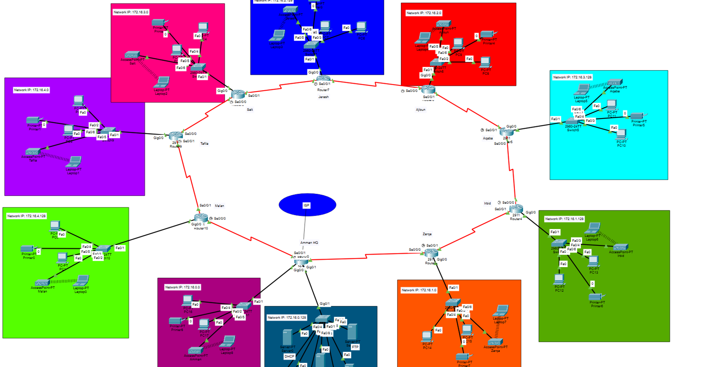

# network-design-and-implementation
Network design and implementation project using Cisco Packet Tracer with OSPF, DHCP, DNS, and multi-branch topology.
# 🌐 Network Design and Implementation Project

## 📌 Overview
This project demonstrates the design and implementation of a multi-branch network using Cisco Packet Tracer. The network supports multiple locations with efficient routing, structured IP addressing, and fully configured network services.

---

## 🏗️ Network Design
- LAN subnetting using /25 (supports up to 100 devices per branch)
- WAN point-to-point connections using /30
- Private IP addressing scheme (172.16.0.0/16)
- Structured and scalable topology

---

## 🌍 Network Topology

---

## ⚙️ Technologies and Protocols
- **Routing:** OSPF (Open Shortest Path First)
- **IP Assignment:** DHCP
- **Name Resolution:** DNS
- **Web Services:** HTTP / HTTPS
- **Email Services:** SMTP, POP3
- **File Transfer:** FTP

---

## 🏢 Network Structure
- Multiple branches (Amman HQ, Irbid, Aqaba, etc.)
- Star topology within each branch
- Point-to-point WAN connections between routers
- Separate server network

---

## 🛠️ Implementation
- Router configuration (interfaces, OSPF routing)
- DHCP configuration with `ip helper-address`
- DNS and web server setup
- Static IP assignment for servers and printers
- Network segmentation for better performance

---

## 🧪 Testing and Verification
- Connectivity testing using `ping` and `traceroute`
- Routing verification using `show ip route`
- DNS resolution testing
- Web and email service validation

---

## 📈 Outcome
The network was successfully implemented with:
- Full connectivity between all branches
- Efficient routing using OSPF
- Proper IP addressing and subnetting
- Functional network services (DHCP, DNS, HTTP, Email)

---

## 🚀 Future Improvements
- VLAN implementation for department segmentation
- OSPF multi-area design for scalability
- Redundant links for high availability
- Enhanced security (firewalls, ACLs)

---

## 📁 Files Included
- `FinalNet.pkt` → Cisco Packet Tracer file
- `NetworkingFinalReport.docx` → Project report
- `Screenshot.png` → Network topology
